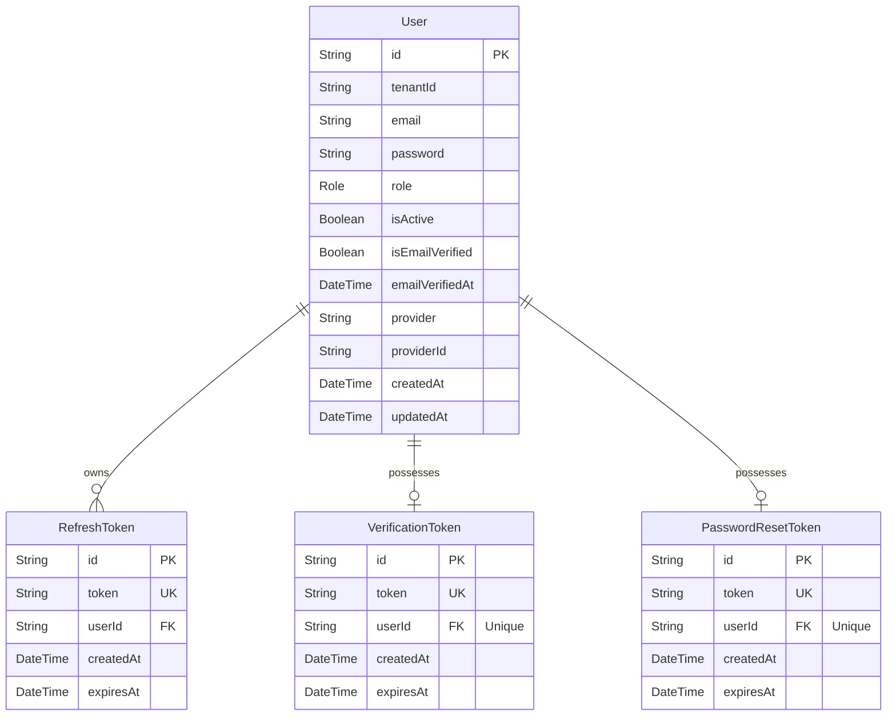
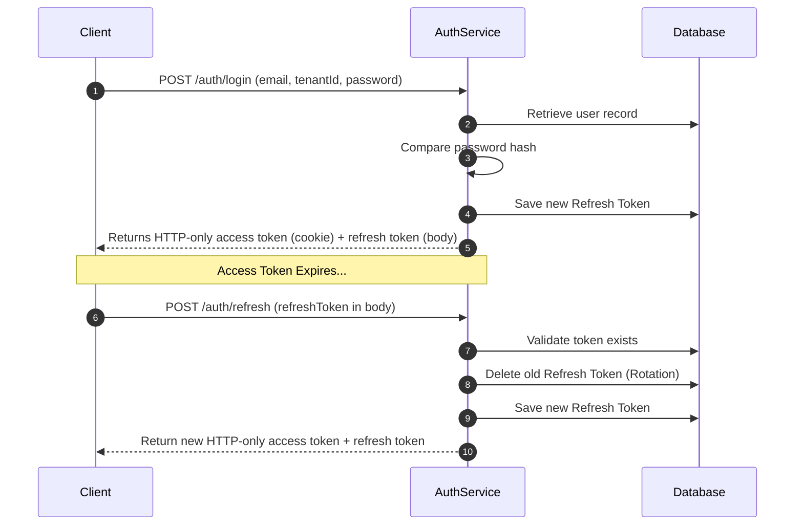
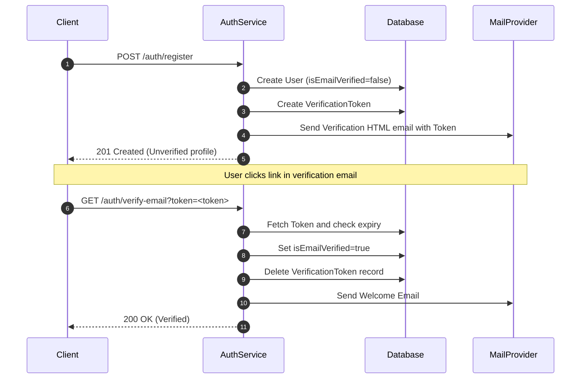
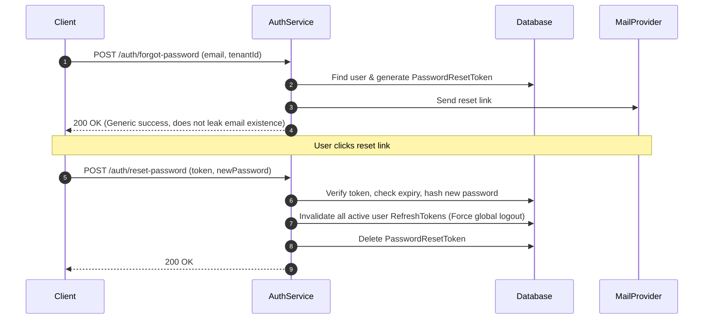
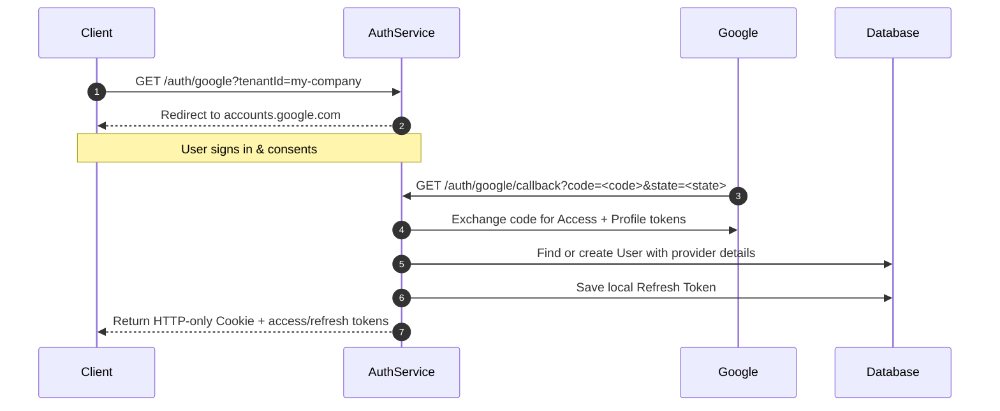

# AuthJwtMS


> **Production-ready Multi-Tenant Identity & Authentication Microservice for Node.js applications.**

`AuthJwtMS` is a lightweight, decoupled microservice designed to serve as the single source of truth for user identification, credential verification, and session management. It features database-backed token rotation, rate-limiting, and multiple identity providers.

---

## 📖 Table of Contents

1. [Key Features](#-key-features)
2. [Architecture Overview](#-architecture-overview)
3. [Directory Layout](#-directory-layout)
4. [Security Model](#-security-model)
5. [Database Schema](#-database-schema)
6. [Core Lifecycles & Flows](#-core-lifecycles--flows)
   - [Multi-Tenancy Model](#multi-tenancy-model)
   - [Authentication & Token Rotation](#authentication--token-rotation)
   - [Email Verification](#email-verification)
   - [Password Recovery](#password-recovery)
   - [OAuth & Federated Identity](#oauth--federated-identity)
7. [Distributed Rate Limiting](#-distributed-rate-limiting)
8. [Observability & Health Checks](#-observability--health-checks)
9. [Local Development Setup](#-local-development-setup)
10. [Docker Orchestration](#-docker-orchestration)
11. [Configuration Reference](#-configuration-reference)
12. [API Reference](#-api-reference)
13. [Example Payloads](#-example-payloads)
14. [Production Deployment Checklist](#-production-deployment-checklist)
15. [Roadmap](#-roadmap)

---

## ⚡ Key Features

- **Multi-Tenant Isolation**: Scope all users by a `tenantId` parameter, allowing one service instance to host multiple independent organizations.
- **Token Rotation (RTR)**: Implements Refresh Token Rotation. Using a refresh token invalidates it and issues a new pair, preventing replay attacks.
- **Robust Verification & Recovery**: Native flows for cryptographically secure email verification and password resets with automatic active session invalidation on password change.
- **OAuth & Federated Logins**: Standard OAuth authorization code flow support for Google, along with client-side verification adapters for Firebase Auth ID tokens.
- **Distributed Rate Limiting**: Multi-instance safe rate limiting backed by Redis, with a built-in memory fallback if connection drops.
- **Observability**: Request correlation ID tracking (`X-Request-Id`) across asynchronous contexts, coupled with structured `pino` logger feeds.
- **Container Optimized**: Production-grade multi-stage `Dockerfile` and `docker-compose.yml` for quick deployments.

---

## 🏗️ Architecture Overview

The system strictly follows the layered **Controller-Service-Repository** pattern:

```
┌────────────────────────────────────────────────────────┐
│                     Client Request                     │
└──────────────────────────┬─────────────────────────────┘
                           │
                           ▼
┌────────────────────────────────────────────────────────┐
│                     Routing Layer                      │
│     - Applies rate-limit-redis limiters                │
│     - Runs Zod schema input validation                 │
│     - Handles CORS, Cookie parser, and Correlation ID  │
└──────────────────────────┬─────────────────────────────┘
                           │
                           ▼
┌────────────────────────────────────────────────────────┐
│                   Controllers Layer                    │
│     - Decouples HTTP request and response structures    │
│     - Manages HTTP-only JWT Cookie attachments        │
└──────────────────────────┬─────────────────────────────┘
                           │
                           ▼
┌────────────────────────────────────────────────────────┐
│                     Services Layer                     │
│     - Executes core business rules                     │
│     - Handles token generation, crypto hashing, mail   │
└──────────────────────────┬─────────────────────────────┘
                           │
                           ▼
┌────────────────────────────────────────────────────────┐
│                   Repositories Layer                   │
│     - Manages data access via Prisma Client queries    │
└──────────────────────────┬─────────────────────────────┘
                           │
                           ▼
┌────────────────────────────────────────────────────────┐
│                   PostgreSQL Database                  │
└────────────────────────────────────────────────────────┘
```

---

## 📂 Directory Layout

```
AuthJwtMS/
├── prisma/
│   └── schema.prisma        # Prisma ORM Database schemas & configuration
├── src/
│   ├── app.js               # Express application config, middlewares and global routes
│   ├── server.js            # Node listener starter (handles connection pool and signals)
│   ├── config/              # Environment parser, log configurations, Prisma exports
│   ├── middlewares/         # Middleware suite (Authentication, rate limiters, request IDs)
│   ├── utils/               # AppError class, JWT wrappers
│   ├── providers/           # Third-party integrations
│   │   ├── mail/            # Extensible email compiler (Nodemailer, Templates)
│   │   └── oauth/           # Extensible federated auth wrappers (Google, Firebase)
│   ├── templates/           # Email templates (verification, reset, welcome HTML)
│   └── modules/             # Business Domain Modules
│       ├── auth/            # Auth controllers, service, routes, zod schemas, database queries
│       └── admin/           # Admin user management, status patchers, and signup analytics
```

---

## 🛡️ Security Model

`AuthJwtMS` implements defense-in-depth security best practices:

- **JWT Storage**: Access tokens are kept short-lived (e.g. 15m) and delivered back via `httpOnly`, `secure` (production-enforced), and `sameSite: strict` cookies, preventing XSS-based token extraction.
- **Credential Storage**: Cryptographically hashed using `bcryptjs` with a cost factor of `12`.
- **Token Rotation & Invalidation**: Refresh tokens are registered in the database. When a user requests an access token rotation, the old refresh token is marked used and deleted. If a token is reused, it raises a flag, and the user's refresh session is invalidated.
- **Account Disabling**: Banning or updating user credentials immediately revokes all refresh tokens registered for their ID.
- **Rate-Limiting Protection**: Authentication-sensitive routes restrict brute-force attacks via sliding window rate limits.

---

## 🗄️ Database Schema

Data connections are mapped using the following relational model:



---

## 🔄 Core Lifecycles & Flows

### Multi-Tenancy Model
The microservice implements multi-tenancy at the data row level using a composite unique constraint on `[tenantId, email]`. This architecture allows one backend process to service multiple corporate clients.
- Users registering under `tenantId: "company-a"` can use `email: "admin@domain.com"`.
- Users registering under `tenantId: "company-b"` can also use `email: "admin@domain.com"`.
- Requests to sign up, log in, or reset password must provide both `tenantId` and `email` to resolve the user context.

---

### Authentication & Token Rotation
Access tokens (short expiry) and Refresh tokens (long expiry) operate under a sliding expiration lifecycle:



---

### Email Verification
New account activations require email verification to prevent spam and domain hijacking:



---

### Password Recovery
If a user requests a password recovery token, it invalidates previous tokens and secures verification:



---

### OAuth & Federated Identity
Supports logging in via external providers:



---

## ⚡ Distributed Rate Limiting

To survive in multi-replica container environments, `AuthJwtMS` uses Redis-backed rate limiting using `rate-limit-redis`.
- **Auth Routes (`/auth/register`, `/auth/login`, `/auth/forgot-password`, `/auth/reset-password`)**: Strict limits (default `10` requests per `15 minutes`).
- **Admin Routes (`/admin/*`)**: Standard limits (default `100` requests per `15 minutes`).
- **Memory Fallback**: If connection to the Redis cache drops, the rate limiters fall back to standard in-memory storage, logging warnings via `pino` without crashing the microservice.

---

## 📊 Observability & Health Checks

### Correlation IDs
To trace execution flows, `AuthJwtMS` generates a unique UUID for every incoming request.
- The ID is attached via the `X-Request-Id` response header.
- Leveraging Node's `AsyncLocalStorage`, this correlation ID is automatically included inside all asynchronous console log traces:
```json
{"level":30,"time":1780085463844,"pid":8204,"hostname":"server","requestId":"f83b381a-2895-46f3-a261-71fb2c694a10","msg":"User logged in successfully"}
```

### Health Diagnostics

- **`GET /health`**: Evaluates basic server health.
  ```json
  {
    "status": "ok",
    "uptime": 124.52
  }
  ```
- **`GET /ready`**: Evaluates server readiness by verifying Postgres DB and Redis connections. Returns `503` if a connection is lost.
  ```json
  {
    "status": "ready",
    "database": "connected",
    "redis": "connected"
  }
  ```

---

## 💻 Local Development Setup

### Prerequisites
- Node.js (>= 18)
- PostgreSQL
- Redis (Optional, rate limiting will fall back to memory)

### Setup Steps
1. **Install Dependencies**:
   ```bash
   npm install
   ```
2. **Setup Configurations**:
   Create a `.env` file in the root directory (based on `.env.example`).
3. **Database Migration**:
   ```bash
   npx prisma migrate dev --name init
   ```
4. **Generate Prisma Client**:
   ```bash
   npx prisma generate
   ```
5. **Start Dev Server**:
   ```bash
   npm run dev
   ```

---

## 🐳 Docker Orchestration

You can boot the microservice and its required database/cache systems using Docker Compose.

```bash
# Build and boot the stack
docker compose up --build
```

The stack configures:
- **`postgres:15-alpine`** representing the main PostgreSQL server on port `5432`
- **`redis:7-alpine`** representing the cache and rate-limiting system on port `6379`
- **`auth-service`** compiled via a multi-stage Dockerfile on port `3000`

---

## ⚙️ Configuration Reference

| Environment Variable | Description | Default | Type | Required |
| :--- | :--- | :--- | :--- | :--- |
| `PORT` | Listening port for the Express application. | `3000` | String | No |
| `NODE_ENV` | Mode of operation (`development`, `production`, `test`). | `development` | Enum | No |
| `DATABASE_URL` | PostgreSQL connection string. | - | String | **Yes** |
| `JWT_ACCESS_SECRET` | Secret string for signing short-lived access tokens. | - | String | **Yes** |
| `JWT_REFRESH_SECRET` | Secret string for signing refresh tokens. | - | String | **Yes** |
| `JWT_ACCESS_EXPIRES_IN` | Life length format for access token. | `15m` | String | No |
| `JWT_REFRESH_EXPIRES_IN`| Life length format for refresh token. | `7d` | String | No |
| `ALLOW_UNVERIFIED_LOGIN`| Allows user log in even if email verification is pending.| `false` | Boolean | No |
| `REDIS_HOST` | Hostname of the Redis server. | `localhost` | String | No |
| `REDIS_PORT` | Port of the Redis server. | `6379` | Number | No |
| `REDIS_URL` | Redis connection URL (overrides HOST/PORT). | - | String | No |
| `SMTP_HOST` | Hostname of your email gateway. | - | String | No |
| `SMTP_PORT` | SMTP port (e.g. 587, 465). | `587` | String | No |
| `SMTP_USER` | SMTP username. | - | String | No |
| `SMTP_PASS` | SMTP password. | - | String | No |
| `SMTP_FROM` | Sender address in outbound emails. | `no-reply@authjwtms.com`| String | No |
| `GOOGLE_CLIENT_ID` | OAuth Client ID from Google. | - | String | No |
| `GOOGLE_CLIENT_SECRET` | OAuth Client secret from Google. | - | String | No |
| `GOOGLE_CALLBACK_URL` | OAuth redirect callback handler route. | - | String | No |
| `FIREBASE_SERVICE_ACCOUNT_JSON`| Firebase service account credentials (JSON string). | - | String | No |

---

## 🚀 API Reference

### Auth Endpoints

| Method | Endpoint | Description | Payloads (Body / Query) |
| :--- | :--- | :--- | :--- |
| `POST` | `/auth/register` | Sign up a new user scoped by tenant. | `{ tenantId, email, password }` |
| `POST` | `/auth/login` | Log in and receive tokens. | `{ tenantId, email, password }` |
| `POST` | `/auth/refresh` | Rotate expired Access Token. | `{ refreshToken }` |
| `POST` | `/auth/logout` | Invalidate current Refresh Token. | `{ refreshToken }` |
| `GET` | `/auth/verify-email`| Verification link handler. | `?token=<token>` |
| `POST` | `/auth/resend-verification`| Resend verification email. | `{ email, tenantId }` |
| `POST` | `/auth/forgot-password`| Send password recovery token. | `{ tenantId, email }` |
| `POST` | `/auth/reset-password`| Confirm password recovery. | `{ token, newPassword }` |
| `GET` | `/auth/google` | Trigger Google OAuth sign-in. | `?tenantId=<tenantId>` |
| `GET` | `/auth/google/callback`| Callback URL for Google OAuth. | `?code=<code>&state=<state>` |
| `POST` | `/auth/firebase` | Exchange Firebase token for local session.| `{ idToken, tenantId }` |
| `GET` | `/auth/verify` | Validate current access session token. | Header `Authorization: Bearer <token>` |
| `GET` | `/auth/me` | Retrieve profile data. | Header `Authorization: Bearer <token>` |

---

## 📝 Example Payloads

### POST `/auth/login` Response
```json
{
  "status": "success",
  "data": {
    "user": {
      "id": "e83a788e-fa14-4903-b09e-71fb2c694a10",
      "tenantId": "my-organization",
      "email": "user@domain.com",
      "role": "USER",
      "isActive": true,
      "isEmailVerified": true,
      "emailVerifiedAt": "2026-05-30T01:29:16.000Z",
      "provider": "local",
      "providerId": null,
      "createdAt": "2026-05-30T01:00:00.000Z",
      "updatedAt": "2026-05-30T01:29:16.000Z"
    },
    "accessToken": "eyJhbGciOiJIUzI1NiIsInR5cCI6IkpXVCJ9...",
    "refreshToken": "709cb8d9a24c2598379201f893..."
  }
}
```

---

## 🔒 Production Deployment Checklist

Before deploying this service to production, verify the following configuration settings:
1. **Disable Insecure Logins**: Set `ALLOW_UNVERIFIED_LOGIN=false` so only verified emails can log in.
2. **Configure Secure Cookies**: Ensure `NODE_ENV=production` is set so that access token cookies are only sent over HTTPS (`secure: true`).
3. **Database Connection Pool**: Set appropriate connection pooling params in `DATABASE_URL` (e.g. `&connection_limit=20`) to handle concurrent database queries.
4. **Secrets Management**: Replace all default secrets (`JWT_ACCESS_SECRET`, `JWT_REFRESH_SECRET`) with strong, cryptographically generated values stored in an environment secret manager (e.g., AWS Secrets Manager, HashiCorp Vault).
5. **SMTP Relay**: Avoid test relays (like Mailtrap) and integrate a production-ready SMTP relay (e.g., AWS SES, SendGrid, Mailgun) in `SMTP_HOST`.
6. **Clustering & Orchestration**: Deploy behind a load balancer (such as Nginx, AWS ALB) with SSL termination, allowing instances to scale horizontally inside Kubernetes or ECS while sharing rate limits via Redis.

---

## 🗺️ Roadmap

Future features planned for `AuthJwtMS`:
- [ ] **Multi-Factor Authentication (MFA)**: Support TOTP via Google Authenticator.
- [ ] **SSO / SAML 2.0 Integration**: Provide federation support for Okta and Microsoft Entra ID.
- [ ] **More OAuth Providers**: Add GitHub, Discord, and Microsoft out-of-the-box.
- [ ] **Audit Trail Log Exports**: Export auditable user authentication records directly to SIEM pipelines (e.g., Datadog, Elasticsearch).
- [ ] **Tenant Provisioning API**: Expose admin endpoints to programmatically manage and configure tenants.

---

## 📄 License

Distributed under the MIT License. See [LICENSE](LICENSE) for more information.
